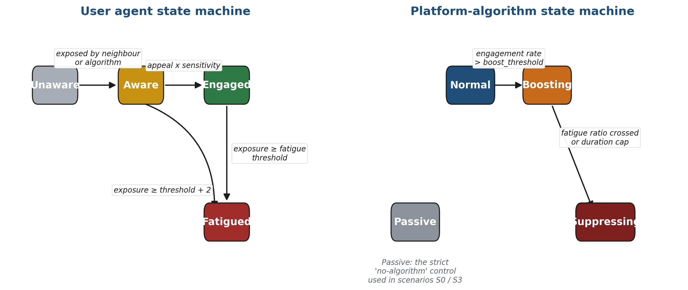
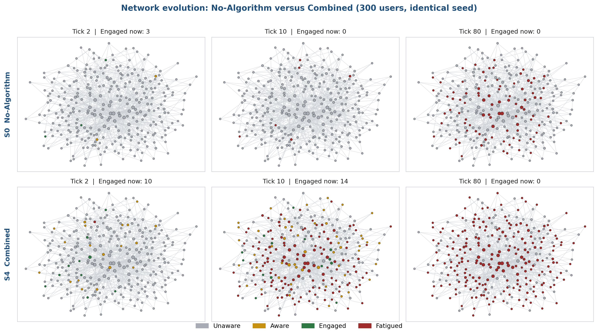
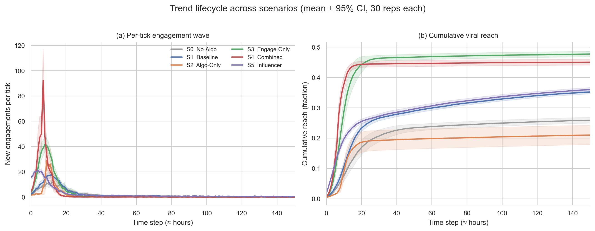
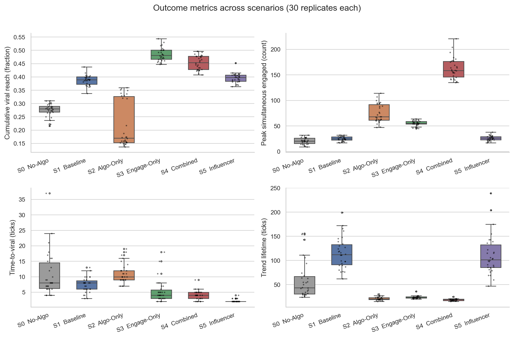
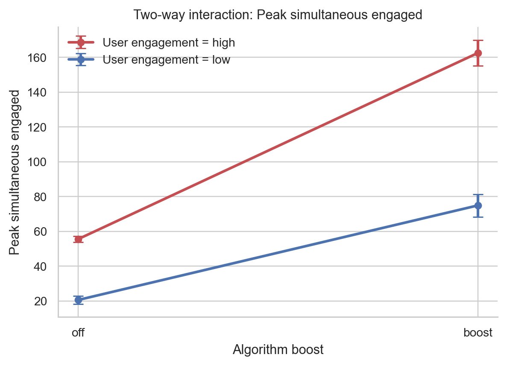
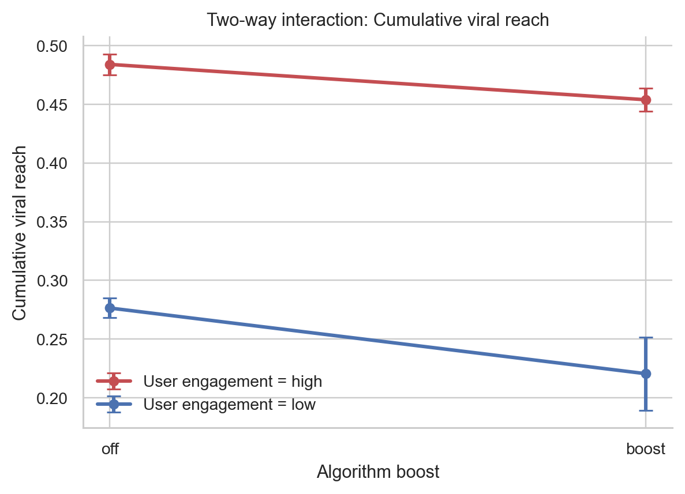
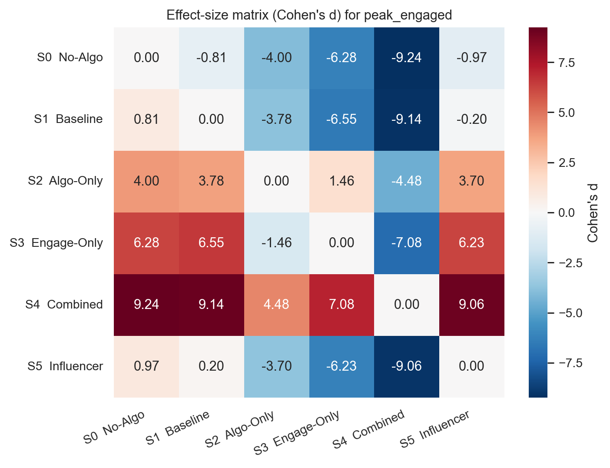
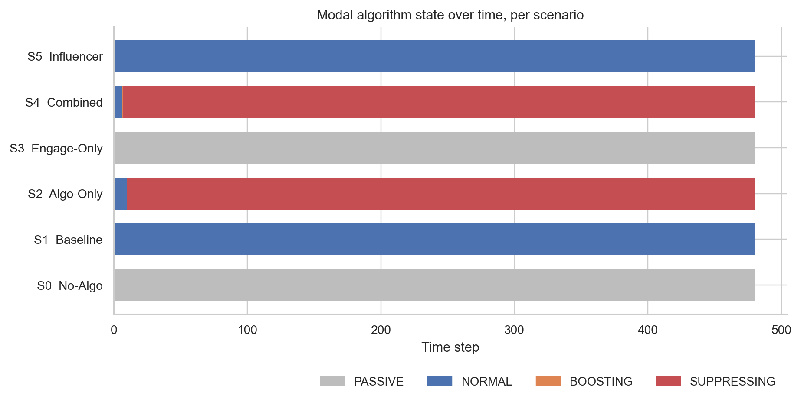
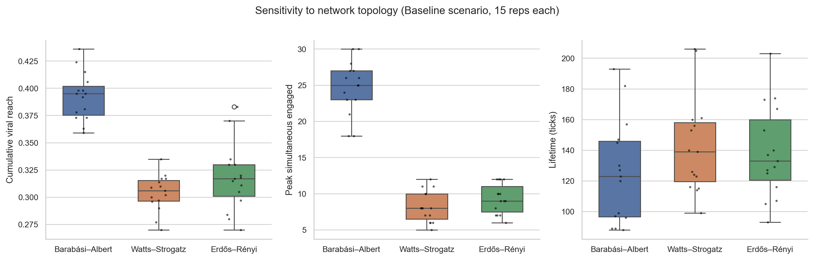
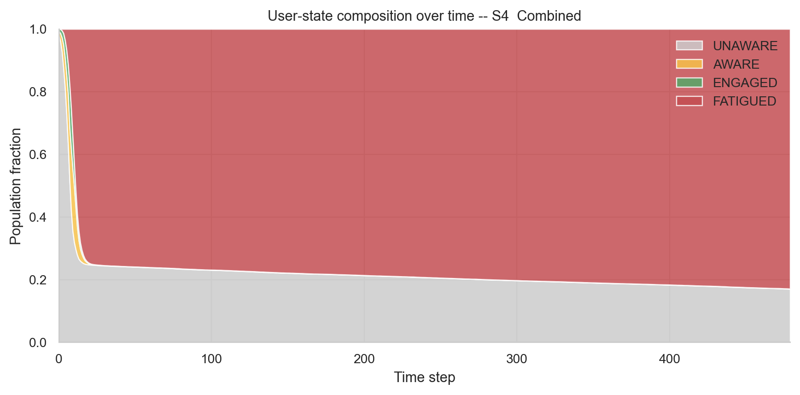

# Social-Media Virality and Content Lifecycle
## An Agent-Based Simulation of Trend Origin, Spread, and Decline

**CMSC 176 — Agent-Based Modeling and Simulation**
**Team 8** &nbsp;|&nbsp; Final Project &nbsp;|&nbsp; 29 May 2026

<br>

> Research question: what role do platform algorithms and organic user
> behaviour play in shaping the full lifecycle of a viral trend?

---

## Outline

1. Problem statement and motivation
2. Research question and hypotheses
3. Model definition: agents, environment, and update rules
4. Experimental design: six scenarios, 30 replicates each (180 runs)
5. Results, with formal statistical testing
6. Conclusion and recommendations for future work

---

## Problem statement

- Social-media platforms host millions of pieces of content per day; only a
  small fraction trend for a meaningful duration.
- Three forces interact non-linearly:
  - intrinsic **content appeal**
  - the **follower-graph topology**
  - the **platform recommender algorithm**
- Existing empirical work concentrates on the peak of virality; the full
  lifecycle — origin, growth, saturation, decline — is less well studied.
- Algorithmic opacity makes it hard to disentangle organic spread from
  amplification using observational data alone.

---

## Research question

> How do social-media trends **originate**, **spread**, and **decline**, and
> what is the **relative contribution** of platform algorithms versus
> organic user engagement at each stage of the lifecycle?

### Sub-questions
- Can the algorithm alone produce virality when users are disengaged?
- Can organic peer-sharing produce virality without algorithmic help?
- Is the combined effect **super-additive** — i.e. is there an interaction?
- Does the **origin point** (random user vs. hub) change the lifecycle?

---

## Hypotheses

### Null hypothesis (H0)
Trend lifecycle outcomes are statistically equivalent across every
combination of algorithm state and user behaviour. Lifecycle dynamics are
essentially random.

### Alternative hypothesis (H1)
Trend lifecycle outcomes differ across scenarios, and specifically the
combination of high engagement and active boosting produces virality that
is statistically larger than the sum of the two factors taken individually
(a positive interaction effect).

### Formal test
Balanced 2x2 factorial ANOVA on (engagement low/high) x (algorithm off/boost).
H1 is supported only if the interaction term is significant.

---

## Model definition — Agents

### User agent (one per node in the social graph)
- **States**: Unaware, Aware, Engaged, Fatigued
- **Sub-types**: Influencer (5%), Regular (75%), Lurker (15%), Skeptic (5%)
- Each sub-type has its own sensitivity, share propensity, fatigue threshold

### Platform-algorithm agent (one global agent)
- **States**: Passive, Normal, Boosting, Suppressing
- Tracks aggregate engagement on a 24-tick sliding window
- Boosts content into Unaware feeds when engagement rate exceeds a threshold
- Transitions to Suppressing when the Fatigued fraction grows large

---

## Model definition — Agent state diagrams



<p class="caption">Two coupled state machines drive every simulation: the
user agent (left) and the single platform-algorithm agent (right).</p>

---

## Model definition — Environment and update rule

### Environment
- **Social graph**: Barabasi-Albert scale-free network, N = 1,000, m = 3
- **Time**: 480 ticks ≈ 30 days at one tick per hour
- **Content**: intrinsic appeal 0.55, novelty half-life 96 ticks

### Per-tick update
1. Apply novelty decay to the content's effective appeal.
2. Algorithm updates state; injects content into Unaware feeds if Boosting.
3. Previous tick's sharers expose their neighbours (peer-share signal).
4. Aware → Engaged with probability = appeal × sensitivity.
5. Engaged users share once with probability = share propensity.
6. Exposure counts accumulate; users above threshold become Fatigued.

---

## Experimental design — 6 scenarios × 30 replicates = 180 runs

| Scenario | Engagement | Algorithm | What it tests |
|---|---|---|---|
| **S0** No-Algorithm | low (30%) | Passive (off) | Word-of-mouth control |
| **S1** Baseline | low (30%) | Normal | Default platform setting |
| **S2** Algorithm-Boost-Only | low (10%) | aggressive Boost | Algorithm-alone driver |
| **S3** High-Engagement-Only | high (60%) | Passive (off) | Organic-alone driver |
| **S4** Combined | high (60%) | aggressive Boost | The interaction cell |
| **S5** Influencer-Seed | low (30%) | Normal | Origin-point effect |

A separate network-sensitivity sweep compares Barabasi-Albert,
Watts-Strogatz, and Erdos-Renyi (15 replicates each).

---

## Simulation in action — network evolution



<p class="caption">The same 300-user graph and seed under two contrasting
scenarios. By tick 10, S4 already has more mid-cascade nodes than the
control; by tick 80, almost every reachable user in S4 is Fatigued.</p>

---

## Interactive simulator (live demonstration)

A browser-based dashboard built on Streamlit exposes **every** model
parameter as a slider and renders the live network, time-series, and
algorithm state during the simulation.

- **Scenario presets** (S0–S5) auto-fill the sliders from the paper.
- **Network view**: nodes coloured by state, sized by follower count.
- **Live charts**: engagement wave, cumulative reach, state composition,
  algorithm-state ribbon, real-time metric counters.
- **Plain-language panel** summarises the setup and results in
  non-technical terms.

```bash
streamlit run app.py
```

---

## Lifecycle curves across scenarios



- **S4 Combined** has the highest peak (~162 engaged per tick).
- **S3 Engagement-Only** has the highest cumulative reach (~48%).
- **S0** and **S2** clearly underperform.
- **S5 Influencer** reaches viral status fastest (TTV ~ 2 ticks).

---

## Outcome metrics — box plots



<p class="caption">Within-cell variance is small and between-cell
differences are large — strong visual evidence that lifecycle outcomes
are not random noise.</p>

---

## Descriptive statistics

|                       | Reach | Peak | TTV | Lifetime |
|-----------------------|------:|-----:|----:|---------:|
| S0 No-Algorithm       | 0.276 |  21  | 11  |   59 |
| S1 Baseline           | 0.387 |  25  |  7  |  116 |
| S2 Algorithm-Only     | 0.221 |  75  | 11  |   21 |
| S3 Engagement-Only    | 0.484 |  56  |  5  |   24 |
| **S4 Combined**       | **0.454** | **162** | **4** | **19** |
| S5 Influencer         | 0.396 |  26  |  2  |  111 |

S4 produces a peak engagement approximately **3.6× higher** than its
nearest competitor — the empirical signature of an interaction effect.

---

## Hypothesis test 1 — Omnibus ANOVA rejects H0

| Metric            | F(5, 174) | p-value | eta-squared |
|-------------------|----------:|--------:|------------:|
| Viral reach       |     185.7 | < 10⁻⁶⁶ | 0.84 |
| **Peak engaged**  | **610.1** | **≈ 0** | **0.95** |
| Time-to-viral     |      28.1 | < 10⁻²⁰ | 0.45 |
| Lifetime          |      84.7 | < 10⁻⁴⁰ | 0.71 |
| Decay rate        |      94.4 | < 10⁻⁴⁵ | 0.73 |

- Every lifecycle metric differs significantly across scenarios.
- Effect sizes (eta-squared) range from 0.45 to 0.95.
- Kruskal-Wallis non-parametric robustness check confirms the same conclusion.

---

## Hypothesis test 2 — The interaction effect

### 2x2 factorial ANOVA on the {S0, S2, S3, S4} block

| Metric           | Engagement   | Algorithm    | Interaction |
|------------------|-------------:|-------------:|------------:|
| Viral reach      | F = 619.5*** | F = 23.6***  | F = 2.13 (p = 0.148) |
| **Peak engaged** | F = 545.8*** | F = 946.3*** | **F = 100.8*** (p < 10⁻¹⁶)** |
| Lifetime         | F = 28.7***  | F = 36.0***  | **F = 21.1*** (p < 10⁻⁴)** |

- **Reach is additive.** Algorithm and engagement contribute independently.
- **Peak intensity is super-additive.** A real interaction; both must fire.
- **Lifetime is sub-additive.** Aggressive boosting *shortens* the trend.

---

## Visualising the interaction — peak engagement



- Lines are **non-parallel** → super-additive interaction.
- Algorithm-alone lifts peak by ~50; engagement-alone lifts by ~35.
- Both together lift the peak by ~140 — well above the sum.

---

## ...versus cumulative reach (contrast)



- Lines are nearly parallel — no interaction on cumulative reach.
- High peer-sharing saturates the network with or without the boost.
- Boosting buys only ~5–8% additional reach on top of organic spread.

---

## Effect sizes — Cohen's d on peak engaged



- S4 vs. S0: **d = 9.24** (well beyond the "large" threshold of 0.8).
- S4 vs. S3: d = 7.08;  S4 vs. S2: d = 4.48.
- S1 vs. S5: d = 0.20 — hub seeding alone does *not* change peak intensity.
- All S4 contrasts significant after Tukey HSD correction.

---

## Algorithm-state dynamics



- S2 and S4 trip Boosting almost immediately, then collapse to Suppressing
  once fatigue spikes.
- **"Going viral" and "staying viral" are partially conflicting objectives.**
- S5 (influencer-seeded baseline) never trips Boosting: fast reach without
  algorithmic acceleration.

---

## Network topology matters



- The **Barabasi-Albert** topology beats WS and ER on every metric.
- Hubs create short paths along which influence propagates.
- A platform's *structure* matters at least as much as its *algorithm*.

---

## State-composition trajectory (S4)



- Population processed Unaware → Aware → Engaged → Fatigued in ~25 ticks.
- ~18 % remain permanently Unaware — the algorithm and peer-share channel
  cannot reach the graph's periphery.
- Dominant terminal state is Fatigued, not Engaged.

---

## Conclusion

1. **H0 is rejected.** Lifecycle outcomes are highly non-random
   (eta-squared ≥ 0.45 on every metric).
2. **A refined form of H1 is supported.** Algorithm and user engagement
   interact super-additively on peak intensity and lifetime, but
   additively on cumulative reach.
3. **Aggressive boosting accelerates both rise and collapse.** It produces
   the highest peaks but the shortest lifetimes.
4. **Network topology is decisive.** Scale-free hubs dominate over
   small-world or random graphs.
5. The model reproduces canonical stylised facts: heavy-tailed exposure
   distributions, short lifetimes, bursty time-series.

---

## Recommendations and future work

- **Multi-content competition** under a finite per-user attention budget —
  explains the empirically observed shrinking of trend lifetimes.
- **An adaptive (learning) algorithm agent** that optimises a reward such
  as daily active engagement, rather than hand-tuned thresholds.
- **Empirical calibration** against a real platform trace (e.g. Twitter
  cascade-size distributions).
- **Richer engagement actions** — comment, react, remix — each with its
  own propagation channel.
- **Scale-up** to 10⁵–10⁶ agents to test whether emergent regimes change
  qualitatively.

---

## Limitations

- N = 1,000 users; real platforms operate at 10⁶–10⁹ scale, where
  additional emergent phenomena may arise.
- A single deterministic algorithm agent, not a learned policy.
- Novelty decay is reasonable but not calibrated to a specific content
  category.
- No out-of-network discovery channel beyond the algorithm itself.
- Within-scenario variability has structural sources (seed location, type
  assignment) that we did not formally decompose.

---

# Thank you
## Questions?

- Full paper, code, data, and figures available in the team repository.
- 180 simulation runs reproduce in under five seconds.
- Author contributions listed on the last page of the paper.

<br>

<div class="small">
References: Goel et al. (2016); Cheng et al. (2014); Bakshy et al. (2012);
Chen (2019); Barabasi and Albert (1999); Cohen (1988).
</div>
